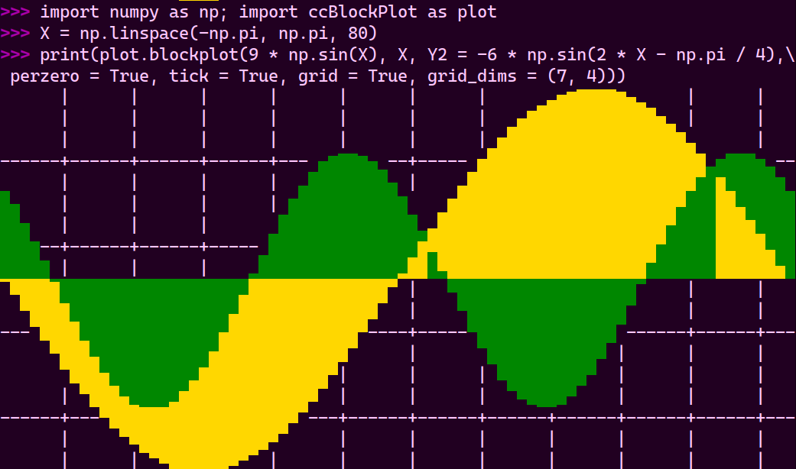
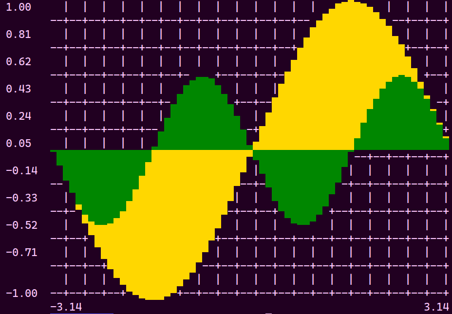

# ccTermPlot - A Textual Bar Graphing Program

## Written by Charlie Cook

# Usage

## Within Python

```Python
import numpy as np; import ccBlockPlot as plot
X = np.linspace(-np.pi, np.pi, 80)
print(
    plot.blockplot(
        9 * np.sin(X), X, Y2 = -6 * np.sin(2 * X - np.pi / 4),
        perzero = True, tick = True, grid = True, grid_dims = (7, 4)
    )
)
```



## Within Shell
```Bash
seq -3.14 0.1 3.14 | awk '{print sin($1)}' | ./ccBlockPlot.py -Ccz -x0 -3.14 -xn 3.14
```



## Shell Args & Flags
```
usage: ccBlockPlot.py [-h] [-C] [-s] [-f InputFile] [-x] [-y0 YMin] [-yn YMax]
                      [-l] [-z] [-t] [-a] [-g] [-c] [-c1 PrimaryColor]
                      [-c2 AuxiliaryColor] [-x0 Minimum] [-xn Maximum]
                      [-gw Width] [-gh Height]

A bar plotter for up to two data streams

options:
  -h, --help            show this help message and exit
  -C, --charliesway     Shortcut for the flags -saltg (see below)

Data:
  Arguments for handling data input

  -s, --stdin           Read the data from stdin; Ideal for piping
  -f, --file InputFile  Read the data from a file

                        The data should be either one number per line,
                        or two numbers per line, separated by a comma;
                        Space & Tab separation also works instead of Lines
  -x, --xlabels         First column of data contains labels;
                        Works in single or double data modes
  -y0, --ymin YMin      Y value that should be at the bottom of the plot;
                        No effect without --adjust
  -yn, --ymax YMax      Y value that should be at the top of the plot;
                        No effect without --adjust

Flags:
  Boolean Arguments for specific adjustments to the plot

  -l, --limits          Write the axis limit values around
                        the corners of the plot
  -z, --perzero         Draw the plot relative to the zero of the Y axis;
                        Positive parts go up, negative parts go down
  -t, --tick            Write tick values at every other text line
                        along the Y axis; No effect without --limits
  -a, --adjust, --scale
                        Transform the data to fit within your terminal
                        automatically; Y axis is scaled, X axis is truncated
  -g, --grid            Draw a grid behind the data, defaults to 3 wide, 2 high

Color:
  Arguments for adjusting color(s) in the plot

  -c, --nocolor         Disable all color in the plot

  -c1, --color1 PrimaryColor
                        Set the primary color of the bars,
                        defaults to bright_gold
  -c2, --color2 AuxiliaryColor
                        Set the auxiliary color (for Y2) of the bars,
                        defaults to bright_pine

                        Colors to choose from are:
                        * violet, purple, pink, red, maroon
                        * gold, yellow, green, pine, cyan
                        * blue, navy, black, gray, white
                        * bright_violet, bright_purple, bright_pink, bright_red, bright_gold
                        * bright_pine, bright_blue, bright_navy, bright_black, bright_gray

Label:
  Arguments for adjusting labels around the plot

  -x0, --xmin Minimum   Minimum/Lefthand X axis label
  -xn, --xmax Maximum   Maximum/Righthand X axis label

                        Labels are strings of at most twelve characters;
                        No effect without --limits
  -gw, --gridwidth Width
                        Width of the background grid
  -gh, --gridheight Height
                        Height of the background grid
```
 
